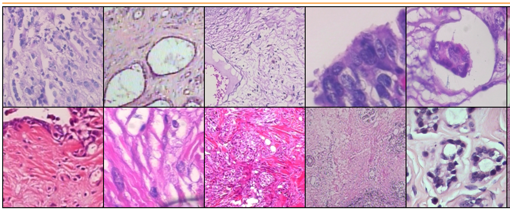
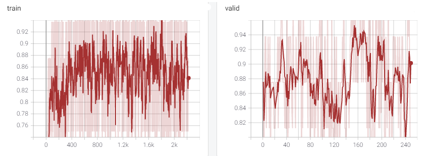
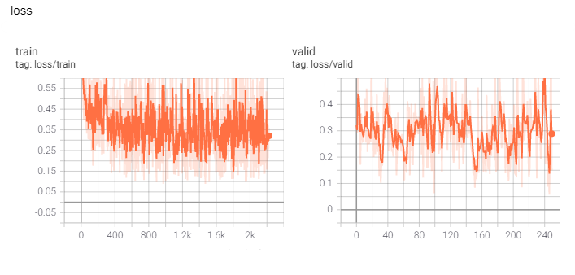

# Breast Cancer Histopathological Dataset (BreakHis)

A computer vision model to detect breast cancer in histopathological images. The two classes include:

- Benign
- and Malignant.

From https://www.kaggle.com/ambarish/breakhis description:

The Breast Cancer Histopathological Image Classification (BreakHis) is composed of 7,909 microscopic images of breast tumor tissue collected from 82 patients using different magnifying factors (40X, 100X, 200X, and 400X). To date, it contains 2,480 benign and 5,429 malignant samples (700X460 pixels, 3-channel RGB, 8-bit depth in each channel, PNG format). This database has been built in collaboration with the P&D Laboratory - Pathological Anatomy and Cytopathology, Parana, Brazil.

The dataset BreaKHis is divided into two main groups: benign tumors and malignant tumors. Histologically benign is a term referring to a lesion that does not match any criteria of malignancy - e.g., marked cellular atypia, mitosis, disruption of basement membranes, metastasize, etc. Normally, benign tumors are relatively "innocents", presents slow growing and remains localized. Malignant tumor is a synonym for cancer: lesion can invade and destroy adjacent structures (locally invasive) and spread to distant sites (metastasize) to cause death.

The dataset currently contains four histological distinct types of benign breast tumors: adenosis (A), fibroadenoma (F), phyllodes tumor (PT), and tubular adenona (TA); and four malignant tumors (breast cancer): carcinoma (DC), lobular carcinoma (LC), mucinous carcinoma (MC) and papillary carcinoma (PC).

We are going to determine if there exists cancer or not.




# Getting Started

The project is broken down into the following steps:
<ol>
    <li>  Load and preprocess the image dataset</li>
    <li> Train the image classifier on your dataset </li>
    <li> Use the trained classifier to predict image content </li> </ol>

### Dependencies

To set up your python environment to run the code in this repository, follow the instructions below.

1. Create (and activate) a new environment with Python 3.6.

	- __Linux__ or __Mac__: 
	```bash
	conda create --name bcdp python=3.6
	conda activate bcdp
	```
	- __Windows__: 
	```bash
	conda create --name bcdp python=3.6 
	activate bcdp
	```

2. Clone the repository (if you haven't already!), and navigate to the `breast-cancer-detection` folder.  Then, install several dependencies.
```bash
git clone https://github.com/mrdvince/breast-cancer-detection.git
cd breast-cancer-detection
pip install -r requirements.txt
```

4. Create a `data` in the root of the project

- Download the dataset from [kaggle](https://www.kaggle.com/ambarish/breakhis)
- Extract the downloaded zip file to the data folder

5. Run `python train.py --config config.json` on the cli with the the environment activated.

6. Config (optional)

- Modify the config json file to experiemnt with different parameters
- `Note: ` Check out this repository for a better understanding on how the folders and files are structured https://github.com/victoresque/pytorch-template

- **_Visiualization_**
        - By default tensorboard is set to `true` in the config file. 
        - Once training is done visit run `tensorboard --logdir saved/log/` on the cli and visit `http://localhost:6006` on the browser.

## Training log metrics
Model used is a densent 121 model(pretrained) and is included in the current repo in the saved folder
Can be used directly or train a different by defining a different model in the models folder and updating it the config file.

#### Training and validation accuracies (logged on tensorboard)


#### Training and validation loss (logged on tensorboard)

